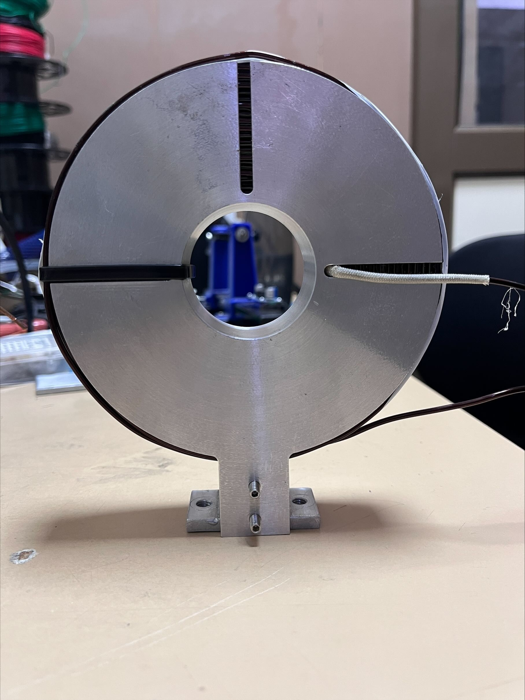
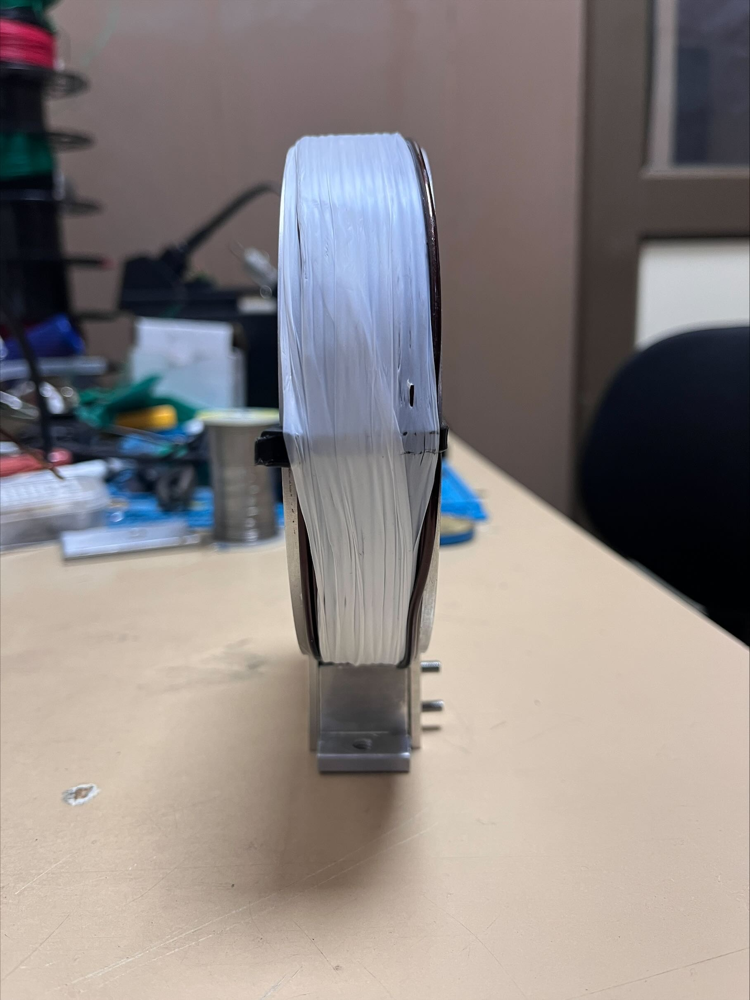
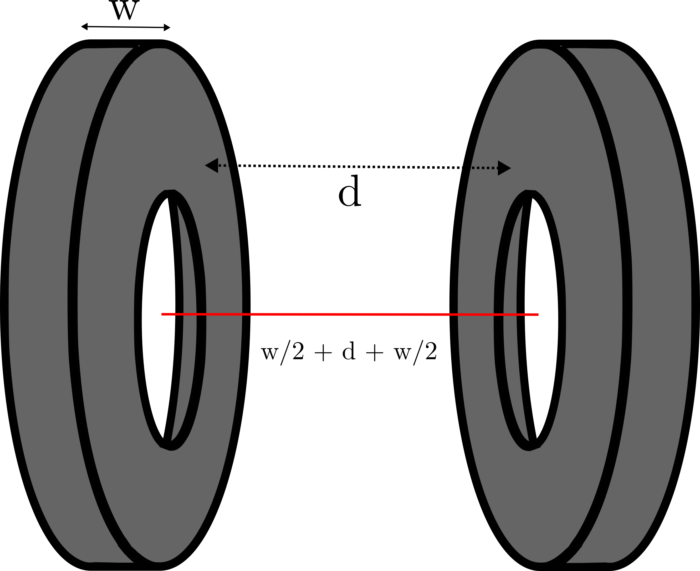

# Anti-Helmholtz-Magnets

MATLAB code the takes in parameters about the design of the magnetic coil pair and models it to ensure that the coils will work as planned.
This code is originally written by the Scott Anderson (@scott-k-anderson)

# Verification

I have attempted to verify this matlab code with real test conditions and this code works really well. Two coils of the given parameter were used in the test.

Axial/Vertical Turns: 12
Radial Turns: 18
Current: 1 A
Radius of the Coil Holder: 4 cm
Diameter of the Wire: 3 mm
Length of between two coils*: 10 cm

*Caution: In here, I have mentioned the distance between surfaces of the coils. But the distance you need to enter in this code will be from the center of the coils. Therefore few cm are added. Hence, length between two coils in this case becomes 1.6 cm + 10 + 1.6 cm = 13.2 cm as shown in the figure below:

These two set of coils were kept in Anti-Helmholtz configuration. The data collected in the experiment is given in the table below.

| Sr. No. | Z [cm]  | Magnetic Field (mGauss) |
| :-------| :-----: | ---------------------:  |
| 01      |   0.5   | -19.5                   |
| 02      |   1.0   | -15.2                   |
| 03      |   2.0   | -11.6                   |
| 04      |   3.0   | -06.6                   |
| 05      |   4.0   | -03.0                   |
| 06      |   4.5   | -01.4                   |
| 07      |   5.0   |  00.0                   |
| 08      |   5.5   |  01.7                   |
| 09      |   6.0   |  03.2                   |
| 10      |   7.0   |  06.6                   |
| 11      |   8.0   |  11.2                   |
| 12      |   9.0   |  15.8                   |
| 13      |  10.0   |  19.5                   |

Here is the plot of the data with Theoretical fit using this code. Note that for the plotting purpose I have subtracted the "Z" with 5 cm so it aligns with theoretical plot. Red circles are the data collected in the experiment and blue line represents the plot from theoretical fit.

